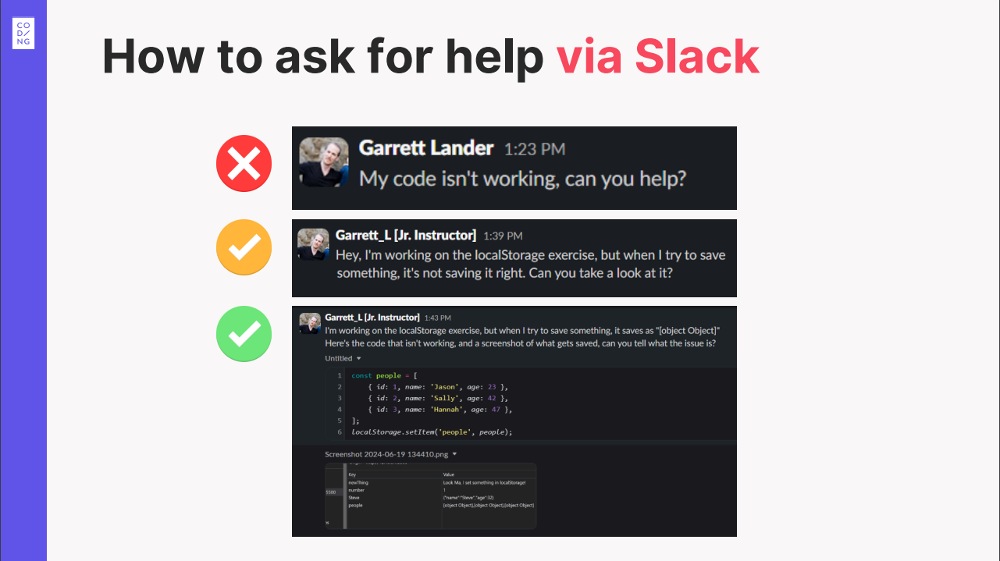

# Effektiv um Hilfe bitten: 5 Schritte zu besseren Antworten

Damit ihr **schnell die beste Hilfe** von Kolleg:innen oder Dozent:innen bekommt, strukturiert eure Fragen klar und fragt direkt (siehe [Don't Ask to Ask](https://dontasktoask.com/)).

**Versucht immer zuerst, das Problem selbst zu recherchieren und zu lösen!**

Wenn ihr trotzdem feststeckt, folgt beim Fragen diesen **5 zentralen Schritten**:

### 1. Kontext geben (Projekt klar verlinken)

- Sag klar, wo du im Curriculum oder Projekt gerade stehst.
- Füg einen direkten Link zu deinem/eurem GitHub-Repo und dem konkreten Branch hinzu.

### 2. Relevanten Code und detaillierte Infos teilen

- Postet den **exakten** Code-Ausschnitt, der das Problem verursacht.
  - Nutz Slacks Code-Block (`</>`) oder die Snippet-Funktion für bessere Lesbarkeit.
  - Wenn du auf GitHub verlinkst, verlinkt **direkt die Datei oder die konkreten Zeilen**, um die es geht.
- Kopier die **exakten** Fehlermeldungen rein - nicht paraphrasieren!
- Wenn du noch keinen Code geschrieben hast: teil Pseudocode oder deinen/euren geplanten Ansatz.
- **Wichtig:** Code/Errors besser als Text posten, nicht als Screenshot. Screenshots primär bei visuellen Layout-Problemen verwenden.

### 3. Problem und aktuelle Situation klar erklären

- Beschreib präzise, was genau nicht funktioniert.
- Liste klare, minimale Schritte, damit jemand anderes das Problem reproduzieren kann (falls sinnvoll).

### 4. Erwartetes Ergebnis beschreiben (was willst du erreichen?)

- Erklär, was dein/euer Code/Projekt **eigentlich** tun soll.
- Benenne das Ziel klar, damit keine Verwirrung entsteht und um das [XY-Problem](https://xyproblem.info/) zu vermeiden.

### 5. Zusammenfassen, was ihr schon probiert habt

- Beschreibe kurz deine/eure bisherigen Versuche und was dabei passiert ist.
- Erwähn, was ihr schon recherchiert oder ausprobiert habt - auch wenn es nicht geklappt hat.
  (Das verhindert doppelte Vorschläge und spart allen Zeit.)

---

**Klare, strukturierte Fragen zu stellen ist eine wertvolle Faehigkeit - Übung macht den Unterschied!**
Wenn du diese Schritte befolgst, verstehen andere dein/euer Problem schneller und können schneller und effektiver helfen. **Hilf uns, dir zu helfen!**
