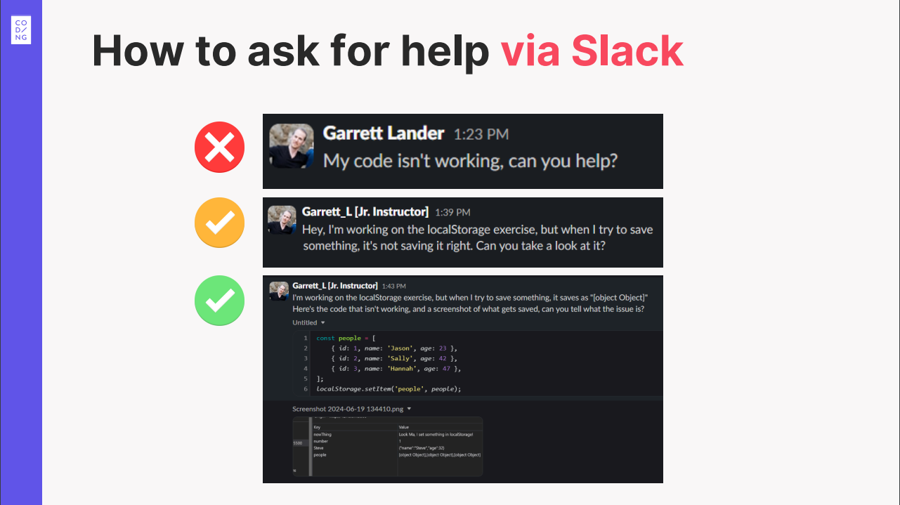

# Asking for Help Effectively: 5 Steps to Better Answers

To get the **best help quickly** from colleagues or instructors, structure your questions clearly and ask directly (see [Don't Ask to Ask](https://dontasktoask.com/)).

**Always try to research and solve the problem yourself first!**

If you're still stuck, follow these **5 essential steps** when asking your question:

### 1. Provide Context (Link Lesson/Project Clearly)

- Clearly specify where you are in the curriculum or project.
- Include a direct link to your GitHub repo and specific branch.

### 2. Share Relevant Code and Detailed Info

- Include the **exact** code snippet causing the issue.
  - Use Slack's code block (`</>`) or snippet feature for readability.
  - If linking to GitHub, link **directly to the file or specific lines** involved.
- Paste the **exact** error messages—don't paraphrase!
- If you haven't written code yet, share pseudocode or your planned approach.
- **Important:** Always use text for code/errors, not screenshots. Use screenshots only for visual layout issues.

### 3. Clearly Explain Your Problem and Current Situation

- Describe precisely the issue you're encountering.
- List clear, minimal steps needed for someone else to reproduce your issue (if applicable).

### 4. Describe Your Expected Outcome (What Are You Aiming For?)

- Explain what your code or project **should** do.
- Clearly state the desired result to avoid confusion and the [XY Problem](https://xyproblem.info/).

### 5. Summarize What You’ve Already Tried

- Briefly outline previous attempts and their outcomes.
- Mention what you've already researched or attempted—even if it didn't work.  
  (This prevents redundant suggestions and saves everyone's time!)

---

**Asking clear, structured questions is a valuable skill—practice makes perfect!**  
Following these steps ensures others understand your issue quickly, allowing them to provide faster, more effective help. **Help us help you!**
