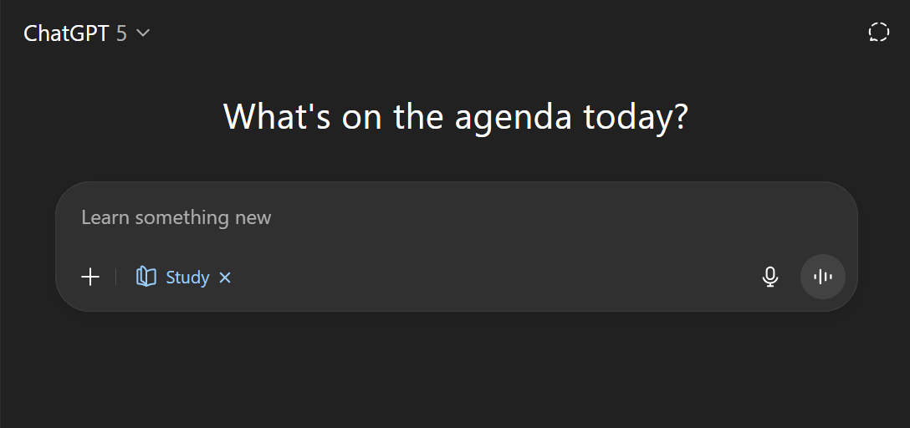

# Lernen lernen: Ein kurzer Leitfaden

Eine neue Faehigkeit zu lernen - besonders etwas Komplexes wie Programmieren - ist eine Reise. Es braucht Zeit, Einsatz und den _richtigen Ansatz_. Dieser Guide sammelt Strategien, die euer Lernen effektiver (und angenehmer) machen.

## 1. Einen Growth Mindset entwickeln

- **Fixed Mindset:** Der Glaube, Intelligenz/Skill sei fix ("Ich bin einfach nicht schlau genug"). Das bremst Lernen.
- **Growth Mindset:** Der Glaube, dass man sich durch Ueben und Einsatz verbessern kann ("Ich kann das _noch_ nicht, aber mit Praxis komme ich dahin"). Das hilft, Herausforderungen anzunehmen und aus Fehlern zu lernen.
- **Warum das wichtig ist:** Herausforderungen werden zu Chancen, zu wachsen - nicht zu Beweisen, dass man es nicht kann. Struggle gehoert zum Prozess; feiert euren Fortschritt. Lob fuer Einsatz foerdert diesen Mindset.
- **Mehr dazu:** 🎥 [Believe you can get better](https://www.youtube.com/watch?v=J-swZaKN2Ic) - _11 min_, Prof. Carol S. Dweck (TEDx Talk)

## 2. Den Lernprozess verstehen

- **Focus- & Diffuse-Mode:** Euer Gehirn wechselt zwischen fokussierter Konzentration (Lernen, Coden, bekannte neuronale Pfade nutzen) und einem entspannten Diffuse-Mode (Spazieren, Duschen, Schlafen - neue Verknuepfungen entstehen). Beides ist entscheidend fuer tiefes Verstaendnis und Problemloesen.
- **Pausen machen:** Weggehen, wenn ihr festhaengt, ist kein Aufgeben - es gibt dem Diffuse-Mode Raum zu arbeiten. Regelmaessige Pausen verhindern Burnout, lassen euer Gehirn erholen und steigern Produktivitaet.
- **Ueben & Anwenden mit Active Recall:** Lesen reicht nicht. Wendet Konzepte in Uebungen/Projekten an. Wichtig: **Active Recall** - Informationen aktiv aus dem Gedaechtnis abrufen (z. B. selbst abfragen, Flashcards) statt passiv erneut zu lesen. Das verbessert Langzeitbehalten deutlich. So ist das Curriculum fuer euch aufgebaut. 🎥 [Mindset of Successful Programmers](https://www.youtube.com/watch?v=nogh434ykF0) - _5 min_, bigboxSWE (YouTube)
- **Festigen durch Erklaeren:** Verstehen, ueben, _erklaeren_. Anderen etwas zu erklaeren ist eine der staerksten Methoden, das eigene Wissen zu festigen. Das passt zur **Feynman Technique**: Ein Konzept einfach zu erklaeren deckt Wissensluecken auf und vertieft Verstaendnis. Uebt das, indem ihr Kolleg:innen helft - das staerkt auch kollaboratives Lernen.

## 3. Was tun, wenn ihr feststeckt?

Festzustecken ist normal. Versucht zuerst:

1. **Googeln:** Sehr wahrscheinlich hatte jemand das Problem schon. Lernt, gezielt zu suchen.
2. **Pause machen:** Lasst euren Diffuse-Mode am Problem arbeiten.
3. **Frage vorbereiten:** Definiert klar das Problem und was ihr schon versucht habt. Hilfe zu holen ist eine wichtige Selbstregulation-Strategie beim Lernen.
   👉 Fuer konkrete Beispiele und eine Struktur zum Fragen: 🔗 [Effektiv um Hilfe bitten](https://github.com/ReynkeDeVos/handouts/blob/main/handout_asking_for_help.de.md)

**Wichtiges Zeitlimit & Hilfeprozess:**

- **NIE laenger als 30 Minuten fokussiert an genau einem Problem festhaengen.**
- Nach 30 Minuten: fragt Kolleg:innen. Kollaboratives Lernen verbessert Verstaendnis. Erklaert klar das Problem und eure Versuche.
- Wenn es mit Kolleg:innen in ca. einer weiteren halben Stunde nicht geloest ist: fragt eure:n Instructor oder nutzt den dedizierten Slack-Channel (`#_questions/_fragen`). Weiterkommen ist entscheidend!

## 4. Zeit managen & typische Fallen vermeiden

- **Konsequent mit Spaced Repetition:** Kurze, regelmaessige Sessions sind effektiver als seltene Marathon-Sessions. Nutzt **Spaced Repetition** - Wiederholen in groesser werdenden Abstaenden kurz bevor ihr es vergesst - das verbessert Langzeitgedaechtnis massiv. Baut euch diese Gewohnheit.
- **Prokrastination vermeiden:** Nutzt Techniken wie Pomodoro (z. B. 55 min arbeiten, 5 min Pause - oder angepasst). Gutes Zeitmanagement haengt mit besseren Ergebnissen und Wohlbefinden zusammen. 🔗 [Pomofocus Timer](https://pomofocus.io/)
- **Ablenkungen minimieren:** Benachrichtigungen aus, ruhigen Lernort suchen. Uebermaessige Handy-Nutzung kann mit Prokrastination zusammenhaengen.
- **Nicht vergleichen:** Vergleicht euren Fortschritt mit _eurem_ frueheren Ich, nicht mit anderen. Jede:r lernt in eigenem Tempo.
- **Auf dem Pfad bleiben:** Vermeidet tiefe Rabbit Holes (Nebenpfade) ausserhalb des aktuellen Lernziels; sie bremsen Momentum.
- **Vorsicht mit AI-Tools (als Beginner):** Tools wie ChatGPT koennen Code generieren, aber zu fruehe Abhaengigkeit kann euch Grundlagen, Problemloesen und die Faehigkeit, euren Code zu erklaeren, untergraben. (Siehe Abschnitt 6.)

## 5. Grit & Durchhaltevermoegen staerken

- **Grit:** Leidenschaft und Ausdauer fuer langfristige Ziele - dranbleiben, auch wenn es schwer ist.
- **Warum das wichtig ist:** Lernen braucht Durchhaltevermoegen. Besonders die Ausdauer hilft, Herausforderungen zu ueberstehen und haengt oft mit Wohlbefinden und Motivation zusammen. Ein Growth Mindset unterstuetzt das.
- **Mehr dazu:** 🎥 [Grit: The power of passion and perseverance](https://youtu.be/H14bBuluwB8?si=BWab-yYEp6qFEp3I) - _6 min_, Prof. Angela Duckworth (TED Talk)

## 6. ChatGPT (AI/LLMs) sinnvoll nutzen

Large Language Models (wie ChatGPT) sind starke Ressourcen - nutzt sie bewusst.

- **Erinnert euch an euer Ziel:** Ihr wollt _lernen_ und Problemloesungs-Skills aufbauen - nicht nur die Antwort bekommen.
- **Direkte Komplettloesungen vermeiden:** Wenn LLMs euch die finale Loesung geben, lernt ihr weniger. Achtet auch auf moegliche Fehler/Limitierungen. Versucht zuerst Google und Doku.
- **Study Modes nutzen:** Wenn ihr ChatGPT oder Gemini nutzt, aktiviert die Study-Mode-Funktionen. Sie sind darauf ausgelegt, euch beim Lernen zu fuehren statt fertige Antworten zu geben.

  

- **NOVA aus dem LMS nutzen:** Das Learning Management System stellt NOVA bereit - sehr aehnlich zu Study Modes.
- **Nie Code copy-pasten:** Faustregel: Kopiert keinen Code direkt in oder aus LLM-Websites/Tools. Tippt ihn selbst ab und erklaert jede Zeile - so baut ihr echtes Verstaendnis und essenzielle Problemloesungsfaehigkeiten auf.

**Wichtig: AI Coding Tools am Anfang deaktivieren**

- **GitHub Copilot in VSCode ausschalten:** Deaktiviert Copilot und andere AI-Coding-Assistenten in den Editor-Settings.
- **AI Coding Tools vermeiden:** Nutzt kein Cursor, Windsurf, Kiro oder aehnliche AI-powered Coding Tools, wenn ihr gerade erst startet.
- **Wann ihr starten solltet:** Erst dann, wenn ihr euch in euren Coding-Skills und eurem Verstaendnis sicher fuehlt. Zu fruehes Nutzen kann den Lernprozess bremsen, weil grundlegende Konzepte und Problemloesen nicht richtig aufgebaut werden.

---

**Key Takeaway:** Effektiv zu lernen heisst: Mindset, Strategie (z. B. active recall und spaced repetition), Ausdauer - und zu wissen, wann/wie man Hilfe holt und Tools kritisch nutzt. Nehmt Herausforderungen an, feiert euren Fortschritt, fragt strategisch, helft anderen, und bleibt dran!

---

## Zusatzressourcen

- 🎥 [Summary of Coursera's Learning How to Learn course](https://youtu.be/O96fE1E-rf8?si=cf2nFuzZCBP7bdS1) - _18 min_, Prof. Barbara Oakley (TEDx Talk )
- 📖 [Managing inspiration and motivation](https://markmanson.net/how-to-get-motivated) - _15min_, Mark Manson (Self-help author)
- 📖 [Learning to code when it gets dark](https://www.freecodecamp.org/news/learning-to-code-when-it-gets-dark-e485edfb58fd#.yjh0fehje) - _20 min_, Alexander Kallaway (freeCodeCamp)
- 📖 ["The Learning Myth: Why I'll Never Tell My Son He's Smart"](https://www.khanacademy.org/college-careers-more/talks-and-interviews/talks-and-interviews-unit/conversations-with-sal/a/the-learning-myth-why-ill-never-tell-my-son-hes-smart) - _6min_, Sal Khan (Khan Academy)
- 🎥 [WaitButWhy on Procrastination](https://www.youtube.com/watch?v=arj7oStGLkU) - _14min_, Tim Urban (TED Talk)
  - 📖 [Why Procrastinators Procrastinate](https://waitbutwhy.com/2013/10/why-procrastinators-procrastinate.html) - _17 min_ (WaitButWhy article explaining the cycle)
  - 📖 [How to Beat Procrastination](https://waitbutwhy.com/2013/11/how-to-beat-procrastination.html) - _25 min_ (WaitButWhy Part 2)

---
